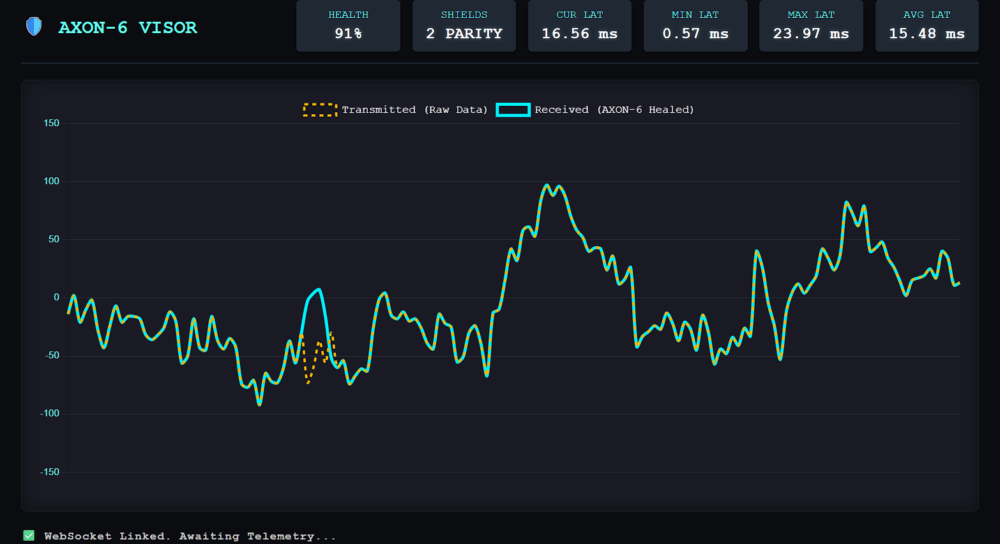

# ⚡ AXON-6
**Real-Time, Self-Healing Neural Telemetry Protocol**

[](https://opensource.org/licenses/MIT)
[](https://www.python.org/downloads/)
[]()


*> The AXON-6 Visor demonstrating mathematical data resurrection. The **dashed orange line** represents raw clinical data destroyed by network packet loss. The **solid cyan line** represents the AXON-6 matrix perfectly healing the signal in real-time.*

## 📦 Installation (Plug & Play)
AXON-6 is now a fully importable Python package. You can install the engine directly from this repository:

```bash
pip install git+[https://github.com/thesnmc/AXON-6.git](https://github.com/thesnmc/AXON-6.git)

🚀 Usage
Start the engine and feed it any data array (brainwaves, robotics, telemetry):
import asyncio
from axon6.emitter import AxonEmitter

async def run():
    engine = AxonEmitter()
    # Feed it 5 floats of data, and AXON-6 handles the matrix healing
    await engine.transmit([12.4, 15.2, -8.1, 0.4, 5.5]) 

asyncio.run(run())


## ⚠️ The Problem: Standard Bio-Telemetry is Broken
When streaming clinical data to robotic interfaces or AR headsets, standard network protocols fail:
* **TCP is too slow:** It guarantees delivery, but introduces a buffering delay. In robotic surgery or BCI control, a half-second lag is catastrophic.
* **UDP is blind:** It operates with zero latency, but if Wi-Fi interference (a microwave, a concrete wall) destroys packets mid-air, the biological data is permanently lost.

## 🚀 The AXON-6 Solution
AXON-6 fixes this by implementing a **Two-Way Adaptive Reed-Solomon Matrix**. 
Instead of just blasting data, the Emitter mathematically wraps microsecond brainwave chunks in a polynomial shield. The Receiver monitors packet loss in real-time. If network weather gets bad, the Receiver uses a secret back-channel to order the Emitter to increase its parity armor mid-flight. 

If packets are destroyed, the Receiver mathematically resurrects them instantly. **Zero latency. Zero data loss.**

---

## 🏗️ System Architecture

```text
  [CLINICAL DATA]                          [6G HOSTILE NETWORK]                         [DEEP HEAL MATRIX]
   Raw .edf files                                                                       
         │                                 (Packet Loss / Storms)                       
         ▼                                           │                                  
 ┌────────────────┐                                  ▼                                 ┌─────────────────┐
 │ THE EMITTER    │   ████████████  (Data Port 5005) ╪  ██████████  (Damaged Data)     │ THE RECEIVER    │
 │ (Python/Async) │ ─────────────────────────────────────────────────────────────────▶ │ (Python/Async)  │
 │                │                                  ╪                                 │                 │
 │ 1. Ingests EDF │                                  │                                 │ 1. Catches Data │
 │ 2. RS Encode   │                                  │                                 │ 2. Heals Drops  │
 │ 3. Broadcasts  │ ◀───────────────────────────────────────────────────────────────── │ 3. Tracks Health│
 └────────────────┘    "MAX SHIELDS!" (Secret Feedback Port 5006)                      └─────────────────┘
         ▲                                                                                      │
         │                                                                                      ▼
 [DYNAMIC ARMOR] ◀────────────────── (Real-Time Parity Adjustments) ──────────────────── [DAMAGE CALCULATION]