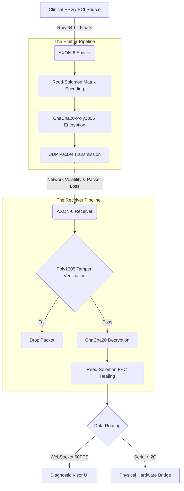

# AXON-6 Telemetry Engine: Master Architecture & Protocol Specification

## 1. High-Level Overview

**Mission Objective:** AXON-6 is a zero-latency, cryptographically secure UDP telemetry engine designed specifically for high-speed brain-computer interface (BCI) to hardware communication. It acts as the secure middleware translating biological float-point arrays into physical kinematic commands for robotic hardware across highly volatile network environments.

**Key Design Principles:**
* **Absolute Speed:** Engineered for sub-millisecond latency. TCP handshakes are bypassed in favor of raw UDP transmission, ensuring kinematic mechanisms never stutter while waiting for dropped packets.
* **Resilience:** Implements dynamic Reed-Solomon forward error correction (FEC) to mathematically reconstruct fragmented packets mid-air without requesting retransmissions.
* **Data Sovereignty & Security:** Operates completely offline with zero cloud dependencies. Every payload is sealed with ChaCha20-Poly1305 military-grade encryption to ensure hardware telemetry cannot be intercepted, spoofed, or hijacked.

---

## 2. The Data Flow (Pipeline)

The lifecycle of a telemetry frame from the data source to the servomotor operates in a strict, unidirectional pipeline. 

---

## 3. Core Components

The architecture is strictly decoupled into three primary nodes:

* **`emitter.py`:** The transmission core. It handles dynamic payload sizing, generates the Reed-Solomon parity matrix, applies the cryptographic seal (Nonces and Ciphertext), and manages the UDP socket output. It operates agnostically of the receiver's state until explicitly commanded to shift shielding tiers.
* **`receiver.py`:** The edge-compute node. Utilizing Python's OS-level asynchronous `DatagramProtocol`, it captures packets via event queueing (preventing CPU idle looping), authenticates MAC tags, decrypts the payload, executes FEC matrix math, and manages memory via a continuous asynchronous garbage collection cycle.
* **`visor.html`:** The diagnostic HUD. A completely decoupled frontend relying on HTML5 Canvas and Chart.js. It connects to the Receiver via localhost WebSockets to plot network health versus healed truth data at 60FPS. The core telemetry pipeline remains 100% unaffected if this UI drops.

---

## 4. The Security Model (V3.3 Secure Core)

AXON-6 assumes all networks are hostile. The security vault is designed to prevent interception, injection, and replay attacks.

* **ChaCha20-Poly1305:** Selected over AES-GCM for superior software-based computational speed on low-power edge devices (e.g., Raspberry Pi, ESP32). It provides both data encryption and message authentication simultaneously.
* **Cryptographic Nonce Injection:** Every packet generates a mathematically unique 12-byte Nonce. This mitigates "Replay Attacks" by ensuring the Receiver rejects duplicate or recorded telemetry frames.
* **The Authenticated Kill Switch (`p_type = 9`):** A hardware-level operational abort that bypasses standard payload structure. It requires an exact matching 32-byte physical secret key, preventing unauthorized network actors from triggering remote shutdowns.

---

## 5. The Resilience Engine

* **Dynamic Matrix Sizing:** The engine calculates payload sizes dynamically via the packet header. It seamlessly scales from processing 5 floats (a robotic end-effector) to 50 floats (a complete exoskeleton) without requiring hardcoded logic refactoring.
* **Reed-Solomon Deep Healing:** Traditional ARQ (Automatic Repeat reQuest) causes catastrophic latency in robotics. AXON-6 utilizes FEC. The Receiver monitors the exact percentage of packet loss and commands the Emitter via a dedicated feedback port to adjust parity tiers (Levels 1, 2, or 3) in real-time to counter network degradation.

---

## 6. Protocol Specification

Any downstream system (C++, Rust, Kotlin) can interface with AXON-6 provided it strictly adheres to this big-endian `>B I I H B B d` byte map.

**Header Format (21 Bytes Total):**
1. **Type (1 byte - `B`):** Packet classifier (`0` = Data, `1` = Parity, `9` = Kill Switch).
2. **Block ID (4 bytes - `I`):** The chronological identifier for the current kinematic frame.
3. **Sequence ID (4 bytes - `I`):** The packet's exact sequential position within the Block matrix.
4. **Payload Length (2 bytes - `H`):** The exact byte-size of the attached encrypted payload.
5. **Parity Count (1 byte - `B`):** The current Reed-Solomon shield level (number of parity packets allocated).
6. **Payload Size (1 byte - `B`):** The total number of original data packets expected before parity execution.
7. **Birth Time (8 bytes - `d`):** 64-bit float Unix timestamp of packet creation for high-precision latency synchronization.

---

## 7. Hardware Integration Bridge (Active Development)

*This section details the hardware firmware bridge converting healed 64-bit float telemetry into physical micro-controller PWM/Serial commands.*
* **Target Hardware:** [Pending Microcontroller Specs]
* **Link Protocol:** [Pending Link - e.g., 115200 Baud USB Serial / I2C]
* **Kinematic Mapping:** [Pending logic for Float-to-Angle mathematical translation]

---

## 8. Architectural Design Decisions

1.  **UDP over TCP:** TCP retransmission protocols introduce kinematic stutter. UDP allows smooth mathematical interpolation of lost frames via the FEC engine.
2.  **Binary Headers:** String parsing (JSON/XML) is excluded in favor of bare-metal `struct` packing to ensure maximal throughput.
3.  **Big-Endian Enforcement:** Normalizes byte order to prevent corruption between x64 Emitters and ARM-based Receivers.
4.  **Decrypt-Then-Heal Pipeline:** Tampered packets fail the MAC tag check instantly, preserving CPU cycles by bypassing the Reed-Solomon algorithms.
5.  **Memory Garbage Collection:** Asynchronous loops purge incomplete blocks after 2.0 seconds, guaranteeing zero memory leaks during total network blackouts.
6.  **Graceful Fallbacks:** Critically destroyed blocks default to `[0.0]` arrays to prevent unhandled `Null` exceptions from crashing physical servomotors.
7.  **OS-Level Asynchronous Queueing:** Replaces standard `while True` polling. The Python runtime idles at 0% CPU until a physical network interrupt occurs.
8.  **Dynamic IP Locking:** Feedback ports default to localhost but instantly lock to the origin IP address of the first incoming packet, supporting dynamic network topologies.
9.  **First-Packet Clock Synchronization:** Establishes a latency baseline independent of external NTP servers, maintaining offline sovereignty.
10. **Headless Core:** The receiver logic operates natively in CLI environments on deeply embedded Linux architectures.
11. **GPLv3 / AGPLv3 Licensing Model:** Enforces data sovereignty and prevents unauthorized closed-source corporate monopolization of the telemetry standard.
12. **C-Backed Cryptography:** Utilizes optimized C-extensions for ChaCha20, achieving encryption speeds that exceed Python's native GIL limitations.
13. **Dual-Line Visual Validation:** The diagnostic Visor physically renders the delta between corrupted network transmission and mathematically healed output.
14. **Asynchronous Target Relaying:** The Emitter broadcasts to the UI independently of the UDP sequence to ensure monitoring tools do not bottleneck transmission.
15. **Adaptive Matrix Logic:** Parity generation is allocated dynamically, eliminating pre-allocated static arrays that consume unnecessary RAM.
16. **Independent Feedback Port:** Isolates high-speed unidirectional telemetry (Port 5005) from command-and-control requests (Port 5006).
17. **Strict Type Coercion:** All incoming biological telemetry is explicitly cast to 64-bit floats before transmission to prevent hardware overflow errors.
18. **Stateless Operations:** The core engine requires no database, local storage, or historical context to maintain continuous operation.
19. **Original-Payload Short-Circuiting (FEC Bypass):** The Receiver bypasses deep matrix healing if only parity packets are lost, saving significant computational overhead.
20. **Zero Cloud Dependency:** The entire technology stack operates entirely on local LAN or point-to-point connections, ensuring maximum privacy by design.

---

## 9. Operational Logic & Troubleshooting (Q&A)

**Q: What is the protocol for out-of-order packet arrival?**
**A:** The Receiver maintains a dictionary buffer mapped to the `seq_id`. Packet arrival order is irrelevant; the engine waits until the buffer length equals the declared `payload_size` before executing sequential reassembly.

**Q: Why utilize a separate Feedback Port (5006) instead of bidirectional communication on Port 5005?**
**A:** Separation of operational concerns. Port 5005 is a high-bandwidth, unidirectional telemetry pipe. Multiplexing command requests into that stream risks blocking the critical hardware path.

**Q: Does AXON-6 support video feed transmission?**
**A:** No. The architecture is exclusively optimized for 64-bit float arrays. Video requires distinct compression codecs (e.g., H.265) and chunking strategies not supported by this engine.

**Q: What is the maximum payload capacity per transmission block?**
**A:** 255 floats per block. This is a strict constraint defined by the 1-byte unsigned char (`B`) tracking the payload size in the binary header.

**Q: How is the "Ghost Port" error (WinError 10048) resolved?**
**A:** If the runtime crashes without releasing the socket, the host OS retains the bind. The Python process must be manually terminated (`taskkill /IM python.exe /F`) to free the UDP port.

**Q: What is the vulnerability profile if the ChaCha20 Secret Key is leaked?**
**A:** The system is fundamentally compromised. As a symmetric encryption protocol, a leaked key requires an immediate operational halt and the deployment of a new 32-byte key to all network nodes.

**Q: Does cryptographic encryption introduce kinematic latency?**
**A:** The overhead is negligible. ChaCha20 introduces sub-millisecond processing times. The physical actuation latency of standard servomotors heavily outweighs the cryptographic processing phase.

**Q: If payloads are encrypted, how does the Receiver identify a Type 9 Kill Switch?**
**A:** The 21-byte binary header remains unencrypted, allowing the Receiver to instantly parse the `p_type` flag and route the logic accordingly. Only the attached data payload is encrypted.

**Q: How is header tampering detected if it remains unencrypted?**
**A:** The Poly1305 MAC tag authenticates the ciphertext. Modifying the exposed header (such as altering the packet size parameters) will cause the decryption validation to fail instantly, dropping the packet.

**Q: Why is diagnostic Truth Data relayed to the Visor unencrypted?**
**A:** The WebSocket diagnostic feed is strictly intended for local visualization (`127.0.0.1`). In a production deployment, this local debug connection is entirely disabled.

**Q: What causes negative latency readings in the diagnostic logs?**
**A:** "Negative latency" is an artifact of high-precision clock drift between the Emitter and Receiver hardware. The `sync_latency` function establishes a baseline, but micro-fluctuations in CPU threading can cause sub-millisecond deviation.

**Q: Why is Parity Tier 3 not enforced globally for maximum protection?**
**A:** Parity 3 generates three supplementary packets per block. This heavily increases network bandwidth consumption and forces edge compute nodes to calculate higher-order polynomials, generating unnecessary thermal output.

**Q: How does the "Fast Track" optimization conserve CPU cycles?**
**A:** If the engine verifies that all original payload packets arrived without loss, it bypasses the `RSCodec.decode` mathematical process entirely, executing an immediate byte unpack.

**Q: Under what conditions is a "Deep Heal" triggered?**
**A:** If the received sequence IDs fail to perfectly match the declared `payload_size`, the Receiver injects the surviving packets into an erasure matrix and tasks the Reed-Solomon engine with solving for the missing vectors.

**Q: What is the "FEC Bypass Optimization"?**
**A:** Earlier architectural iterations triggered Deep Healing even if only parity packets were lost. Logic was implemented to execute the computationally expensive healing algorithm only if an original data packet is confirmed missing.

**Q: How is AXON-6 interfaced with physical microcontrollers?**
**A:** The `AxonReceiver` exposes an `on_data_received` callback. Engineers instantiate the receiver, pass a hardware-specific translation function to that callback, and format the resulting floats for standard serial/I2C transmission.

**Q: Is it required to run the Receiver on the same node as the servomotors?**
**A:** Yes. The strict topological requirement is: Emitter (Compute Node) -> UDP Network -> Receiver (Edge Node wired directly to the robotic hardware).

**Q: How are discrepancies between BCI sampling rates (e.g., 1000 FPS) and servo actuation rates (e.g., 50 FPS) handled?**
**A:** The integration engineer must implement signal decimation or a moving average filter within the `on_data_received` callback to down-sample the telemetry prior to serial transmission, preventing hardware buffer overflow.

**Q: Can the Visor UI be accessed via mobile devices?**
**A:** Yes. Provided the mobile device shares the local area network, modifying the WebSocket IP configuration in `visor.html` to the Receiver's LAN IP enables remote diagnostic monitoring.

**Q: Why is the receiver executed via the Python module flag (`-m`)?**
**A:** This ensures correct Python module routing. Running it as a module allows the scripts within the `examples` directory to properly import the core `axon6` package from the parent directory without utilizing path injection hacks.